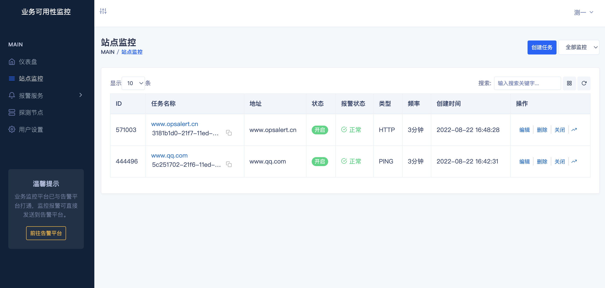
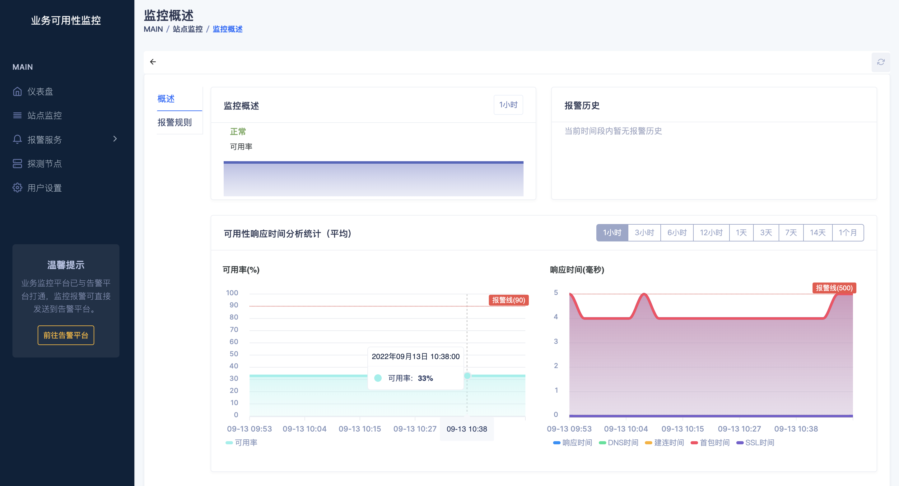
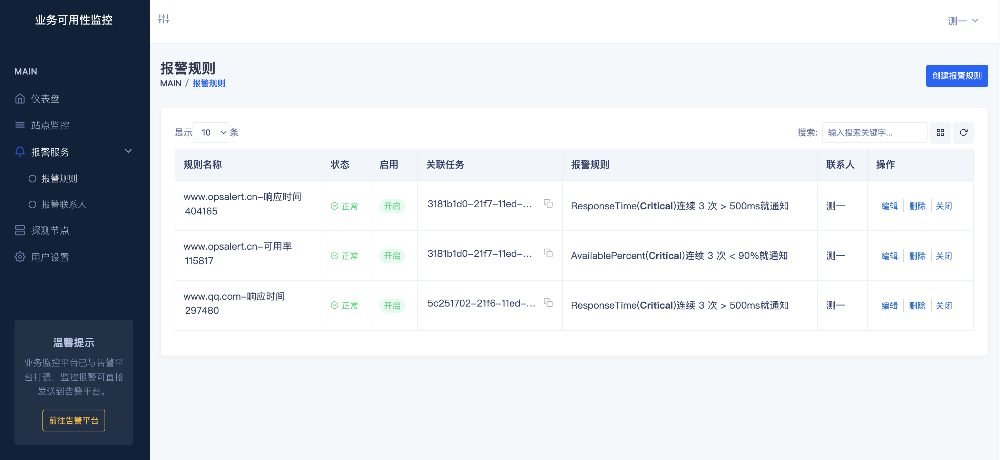

<h1 align="center">Cayo</h1>

一个站点或业务可用性监控平台，支持TCP、UDP、ICMP、SMTP、HTTP(S)等多种协议，模拟真实用户访问探测站点的可用性、连通性、DNS解析等问题。

## 特性

- **多种协议**: 支持TCP、UDP、ICMP、SMTP、HTTP(S)等
- **协作工具**: 支持钉钉、飞书三方协作工具
- **数据报表**: 实时数据统计，呈现不同维度的统计分析数据
- **监控频率**: 最快可达1分钟
- **消息推送**: 可通过邮件、短信、语音、微信等渠道发送告警消息
- **自定义告警**: 可灵活的设置告警阈值，制订告警规则

## 环境

* Golang 1.17
* MongoDB 4.x
* Node 14.x
* React 16.x

## 预览

### 用户登录(默认用户: admin 密码: 123123)

### 站点管理

### 监控概述

### 告警规则

## License
项目基于 MIT 协议，详细请参考 [LICENSE](LICENSE.txt)